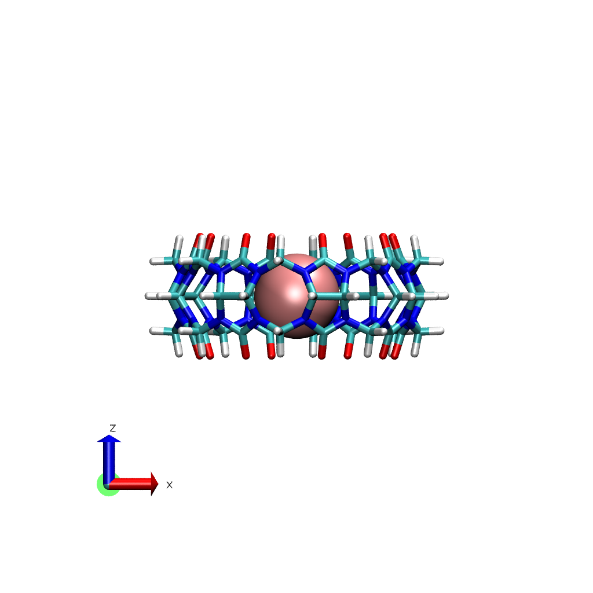
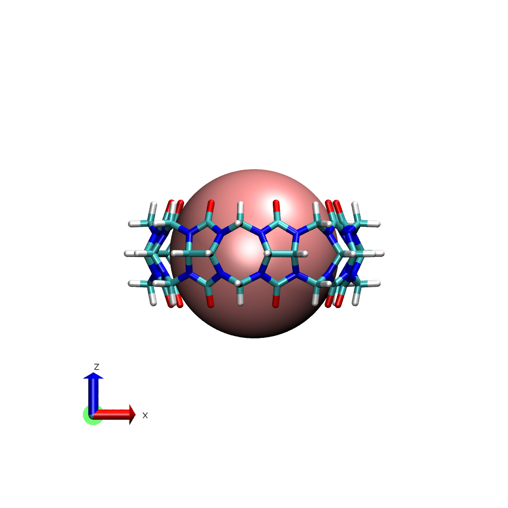

# Pseudo-hard-sphere-solvation-paper
Repository containing setup and analysis scripts used in the paper studying the high-energy water in. This repo contains the scripts to view, model and analyze pushing cavity water out of cucurbit[8]uril (CB8) with pseudo-hard-sphere particle. This theoretical and computational study aims to resolve the existence of high-energy water in cucurbiturils that may explain the high binding free energies observed experimentally. The manuscript describing this work is available [ChemRxiv](http://chemrxiv.org/engage/chemrxiv/article-details/679a4658fa469535b9502fb8).

## Modeling the hard-sphere particle
A hard sphere particle has the following definition

$$\Phi_{\text{hard sphere}} (r_{ij}) = \begin{cases}\infty & r_{ij} \le \sigma \\ 0 & r_{ij} > \sigma \end{cases}$$

where $\sigma$ determines the particle size and $r_{ij}$ is the interatomic distance. However, for molecular dynamics (MD) simulations, we need a functional form that is differentiable. We start with the Mie potential

$$\Phi_{\rm Mie} (r_{ij}) = \frac{c_{r}}{c_{r} - c_{a}}\left(\frac{c_{r}}{c_{a}}\right)^{\frac{c_{a}}{c_{r} - c_{a}}} \epsilon \left[\left(\frac{\sigma}{r_{ij}}\right)^{c_{r}} - \left(\frac{\sigma}{r_{ij}}\right)^{c_{a}}\right]$$

where $c_{r}$ and $c_{a}$ are the exponents of the repulsive and attractive terms. The minimum of the potential function is positioned at

$$R_{\text{min}}^{\rm Mie} \sigma \left(\frac{c_{r}}{c_{a}}\right)^{\frac{1}{c_{r}-c_{a}}}$$

The Mie potential is a generalized form of the Lennard-Jones potential when $c_{r}$ and $c_{a}$ are set as 12 and 6, respectively. To remove the attractive term from the potential, we apply a cut-and-shifted Weeks-Chandler-Anderson perturbation to the Mie Potential.

$$\Phi_{\text{WCA-repulsive}}^{\rm Mie} (r_{ij}) = \begin{cases}\Phi_{\rm Mie}(r_{ij}) + \epsilon & r_{ij}\le R_{\rm min}^{\rm Mie} \\ 0 & r_{ij}>R_{\rm min}^{\text Mie}\end{cases}$$

One observation we made when we played around with the potential above is that the repulsive potential becomes softer as we increase the particle size based on the variable $\sigma$. To overcome this dilemma, we introduce a distance shift using a new variable $R_{\rm particle}$ that controls the particle size instead of $\sigma$

$$r_{ij}' = r_{ij} - (R_{\rm particle} - R_{\rm min}^{\rm Mie})$$

We substitute the definition above for the interatomic distance giving 

$$\Phi_{\text{WCA-repulsive}}^{\rm Mie} (r_{ij}') = \begin{cases}\Phi_{\rm Mie}(r_{ij}') + \epsilon & r_{ij}\le R_{\rm min}^{\rm Mie} \\ 0 & r_{ij}>R_{\rm min}^{\text Mie}\end{cases}$$

For this study we used the following parameters:

| Variable | Value        |
| -------- |--------------|
| $\sigma$ | 3.0 Angstrom |
| $\epsilon$ | 0.1 kcal/mol |
| $c_{r}$ | 50 |
| $c_{a}$ | 49 |
| $R_{\rm particle}$ | 5.0 Angstrom |

The pseudo-hard-sphere potential is modeled using `CustomNonbondedForce` module in OpenMM. Below is a snippet of the implementation

```python
wca_repulsive = CustomNonbondedForce(
    "U_repulsive;"
    "U_repulsive = step(R_particle - r) * (U_Mie + epsilon_wall);"
    "U_Mie = prefactor * epsilon_wall * ((sigma_wall/r_prime)^coeff_r - (sigma_wall/r_prime)^coeff_a);"
    "prefactor = coeff_r/(coeff_r-coeff_a) * (coeff_r/coeff_a)^(coeff_r/(coeff_r-coeff_a));"
    "r_prime = r - (R_particle - R_min);"
    "R_min = sigma_wall * (coeff_r/coeff_a)^(1/(coeff_r-coeff_a));"
)
wca_repulsive.addGlobalParameter("R_particle", 5.0 * unit.angstrom)
wca_repulsive.addGlobalParameter("coeff_r", 50)
wca_repulsive.addGlobalParameter("coeff_a", 49)
wca_repulsive.addGlobalParameter("sigma_wall", 3.0 * unit.anstrom)
wca_repulsive.addGlobalParameter("epsilon_wall", 0.1 * unit.kilocalorie_per_mole)
wca_repulsive.setNonbondedMethod(openmm.CustomNonbondedForce.CutoffPeriodic)
wca_repulsive.setCutoffDistance(nonbonded.getCutoffDistance())
wca_repulsive.setUseLongRangeCorrection(False)
```

## Alchemically-modified hard-sphere potential
To estimate the hydration free energy (HFE) we apply a soft-core potential to prevent end-point catastrophe transforming the Mie potential to

$$\Phi_{\text{softcore}}^{\rm Mie} = \frac{c_{r}}{c_{r} - c_{a}}\left(\frac{c_{r}}{c_{a}}\right)^{\frac{c_{a}}{c_{r} - c_{a}}} \lambda\epsilon \left[\frac{1}{\left[\alpha(1-\lambda)+\left(r_{ij}/\sigma\right)^{c_{a}}\right]^{c_{r}/c_{a}}} - \frac{1}{\alpha(1-\lambda)+\left(\frac{r_{ij}}{\sigma}\right)^{c_{a}}}\right]$$

The location of the minimum will vary with the coupling parameter $\lambda$

$$R_{\rm min}^{\text{Mie-softcore}} (\lambda) = \sigma \left[\left(\frac{c_{r}}{c_{a}}\right)^{\frac{c_{a}}{c_{r} - c_{a}}} - \alpha(1-\lambda)\right]^{1/c_{a}}$$

Applying the WCA perturbation to the equation above gives us the alchemically-modified pseudo hard-sphere potential

$$\Phi_{\text{WCA-repulsive}}^{\text{Mie-softcore}} (r_{ij}',\lambda) = \begin{cases}\Phi_{\rm Mie}^{\rm softcore}(r_{ij}',\lambda) + \lambda\epsilon & r_{ij} \le R_{\rm particle} \\ 0 & r_{ij} > R_{\rm particle}\end{cases}$$

The alchemically-modified pseudo-hard-sphere potential is modeled using `CustomNonbondedForce` module in OpenMM. Below is a snippet of the implementation

```python
wca_repulsive = CustomNonbondedForce(
    "U_alchemical_repulsive;"
    "U_alchemical_repulsive = lambda_sterics * U_repulsive;"
    "U_repulsive = step(R_particle - r) * (U_Mie + epsilon_wall);"
    "U_Mie = prefactor * epsilon_wall * (1/repulsive - 1/dispersive);"
    "repulsive = (dispersive)^(coeff_r/coeff_a);"
    "dispersive = softcore_alpha*(1.0-lambda_sterics) + (r_prime/sigma_wall)^coeff_a;"
    "prefactor = (coeff_r/(coeff_r - coeff_a)) * (coeff_r/coeff_a)^(coeff_a/(coeff_r-coeff_a));"
    "r_prime = r - (R_particle - R_min);"
    "R_min = sigma_wall * ((coeff_r/coeff_a)^(coeff_a/(coeff_r-coeff_a)) - softcore_alpha*(1.0-lambda_sterics))^(1/coeff_a);"
)
wca_repulsive.addGlobalParameter("lambda_sterics", 1.0)
wca_repulsive.addGlobalParameter("softcore_alpha", 0.5)
wca_repulsive.addGlobalParameter("R_particle", 5.0 * unit.angstrom)
wca_repulsive.addGlobalParameter("coeff_r", 50)
wca_repulsive.addGlobalParameter("coeff_a", 49)
wca_repulsive.addGlobalParameter("sigma_wall", 3.0 * unit.anstrom)
wca_repulsive.addGlobalParameter("epsilon_wall", 0.1 * unit.angstrom)
wca_repulsive.setNonbondedMethod(openmm.CustomNonbondedForce.CutoffPeriodic)
wca_repulsive.setCutoffDistance(nonbonded.getCutoffDistance())
wca_repulsive.setUseLongRangeCorrection(False)
```

## Modeling CB8 host with varying attractive LJ potential
Similar to the approach for modeling the pseudo-hard-sphere potential, we use WCA perturbation on the LJ potential of the CB8. Given the LJ potential

$$\Phi_{\rm CB8}^{\rm LJ} = 4\epsilon \left[\left(\frac{\sigma}{r_{ij}}\right)^{12} - \left(\frac{\sigma}{r_{ij}}\right)^{6}\right]$$

We apply a coupling parameter $\lambda$ in a linear fashion (no softcore potential added) and a WCA perturbation, thus

$$\Phi_{\text{WCA-dispersive}}^{\text{CB8-LJ}} (r_{ij}, \lambda) = \begin{cases}\Phi_{\rm LJ}(r_{ij}) + \epsilon(1-\lambda) & r_{ij} \le R_{\rm min}^{\rm LJ} \\ \lambda \Phi_{\rm LJ} (r_{ij}) & r_{ij} > R_{\rm min}^{\rm LJ}\end{cases}$$

When $\lambda = 1$ the equation above becomes the standard LJ(12,6) potential. When $\lambda=0$, we get only repulsive interaction of the LJ potential.

The LJ-dispersive CB8 potential is modeled using `CustomNonbondedForce` module in OpenMM. Below is a snippet of the implementation

```python
wca_dispersive = CustomNonbondedForce(
    "U_dispersive;"
    "U_dispersive = step(R_min - r)*(U_LJ + epsilon*(1 - lambda_dispersive)) + step(r - R_min)*(lambda_dispersive * U_LJ);"
    "U_LJ = 4 * epsilon * x * (x - 1.0);"
    "x = (sigma / r)^6;"
    "R_min = sigma * 2^(1/6);"
    "sigma = 0.5*(sigma1 + sigma2);"
    "epsilon = sqrt(epsilon1 * epsilon2);"
)
wca_dispersive.addGlobalParameter("lambda_dispersive", 1.0)
wca_dispersive.addPerParticleParameter("sigma")
wca_dispersive.addPerParticleParameter("epsilon")
wca_dispersive.setNonbondedMethod(CustomNonbondedForce.CutoffPeriodic)
wca_dispersive.setCutoffDistance(nonbonded.getCutoffDistance())
wca_dispersive.setUseLongRangeCorrection(nonbonded.getUseDispersionCorrection())
wca_dispersive.addInteractionGroup(host_atoms, solvent_atoms)
```

## Visualizing the particle inside CB8
When you load the PDB file containing the CB8, pseudo-hard-sphere particle and water in VMD, the radius if the particle is not rendered properly. Representing the CB8 as licorice sticks and the particle as VDW spheres gives the following visualization



In order to scale the pseudo-hard-sphere particle to the correct radius as simulated, we need to set the radius manually in the Tk console

```Tcl
set particle [atomselect top "resname DM1"]
$particle set radius 5.0
```

With the command above we get a particle with the correct radius



## Notes about repo
All of the MD simulations for this study were done with OpenMM version 7.5.1. I have also tested this with version 8 to any OpenMM versions >7.5 will work.

> [!Note]
> This repo is still a work in progress, there are still many things I will add in the near future.

The file `hard_sphere.py` contains three Python functions that creates the different modifications for this study:
* pseudo-hard-sphere potential: `make_guest_wca_repulsive`
* alchemically-modified pseudo-hard-sphere potential: `alchemicalize_guest_wca_repulsive`
* varying CB8 potential: `make_host_wca_dispersive`

The file `create_hard-sphere.py` creates an System XML file containing the modified potentials after loading the AMBER files `*.prmtop` and `*.rst7` into OpenMM

> [!TODO] 
> Add a script that runs the simulations (with and without umbrella sampling restraints) and the alchemical version that was used to estimate the hydration free energy.